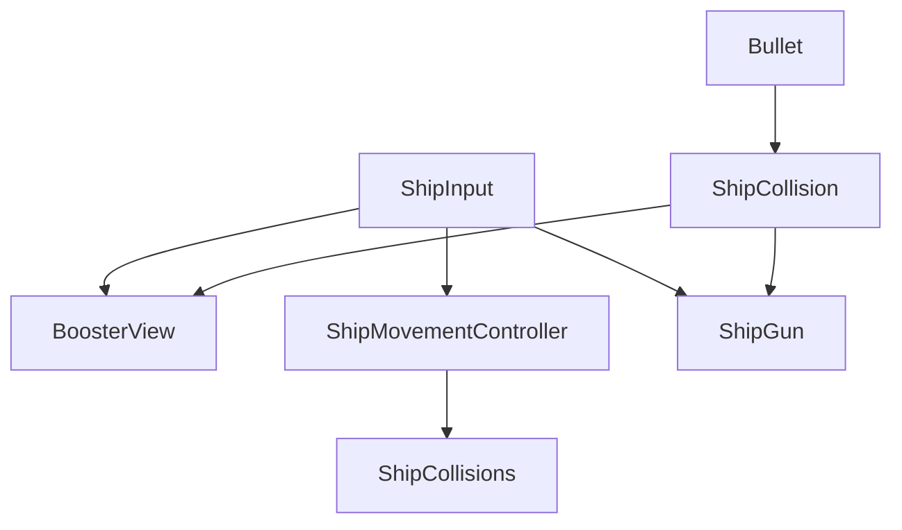
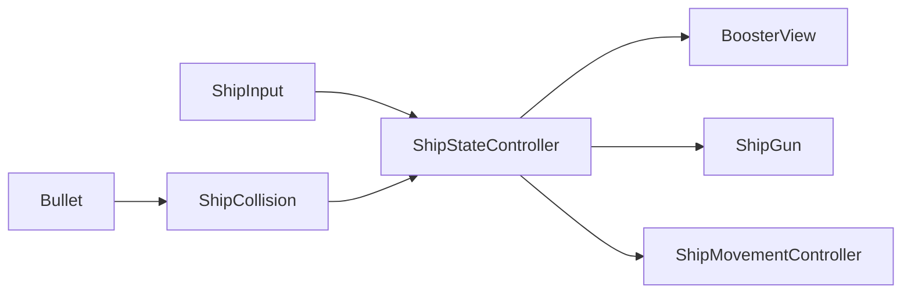

# Logs

### 2023/11/15 14:31 - Starting

I'm starting the project now, before i setup source control and make some other decisions
I wanna see the shape that i want to get the code in, Initially my goal is to set a simple 
implementation that gets the Asteroids game concept working as soon as possible.
I'm planning to use the observer pattern extensively to drive the visual feedbacks,
initially I'm not planning to use any specific framework for this, but if the 
implementation ends up too cumbersome I may introduce UniRx package to the project

### 2023/11/15 15:03 - Structure

I Liked this implementation because instead of having every system aware of and
directly accessing each other

we can do something like this where all the systems are aware of a shared system state

this will also give us more liberty to customize some behaviours after the base game is implemented

### 2023/11/16 16:51 - Git init repo
Quick stop to create git repository and start tracking progress

### 2023/11/16 17:54 - input
Created a component to control how objects in the game will wrap around the camera, i opted to 
create a controller where objects register themselves to have this behavior instead of putting it 
in each object to avoid the performance overhead of making fixed update calls for every object that
has this behaviour

### 2023/11/19 19:50 - shooting
Implemented a bullet behaviour, bullet now has a simple state that is just a bool for now the the despawn/movement
mechanics are separated each in their own behaviour so it is easy to experiment in the future with different
bullet behaviors like powerups, also it is a bad practice to keep instantiating and destroying lots of objects, I'll
leave it like this for now, but if I have time a simple pooling system would easy the performance impact of this system

### 2023/11/19 23:00 - finishing up super fast
I'll finish now the last features to have the basic Asteroids features, a respawn system, the steroid child spawn
behavior ui, asteroid waves etc, I'm focusing now in having the features implemented as as fast as possible, so I'll
make a few tradeoffs to have the game minimally working even if I have to sacrifice quality here or there.

### 2023/11/20 13:29 - version 1.0 Some Considerations
The basic implementation of of the Asteroids gameplay is all there, but a few compromises had to be made to avoid
spending too much time with the project, so a lot of the "desirable" features (points system, upgrades items,
graphics improvements, enemy variety, objects being able to be seen in both sides wen wrapping in the screen,
a unification of the gameplay balancing values) were left in the backlog 

also, there are some libraries that could potentially improve the code structure that I chose to 
not integrate to keep the project more "Unity Vanilla" (Mainly UniDI, UniRX and UniTask). 

I'm Actually ok with those compromises because i believe that there is a clear and direct  path for all those 
improvements that can be be made in an iterative way. 