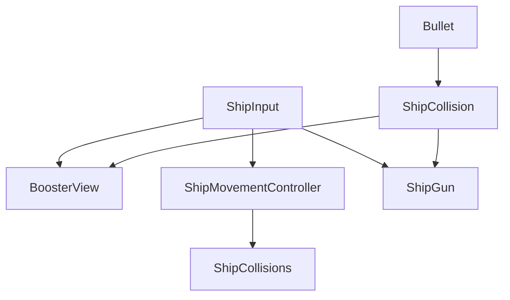
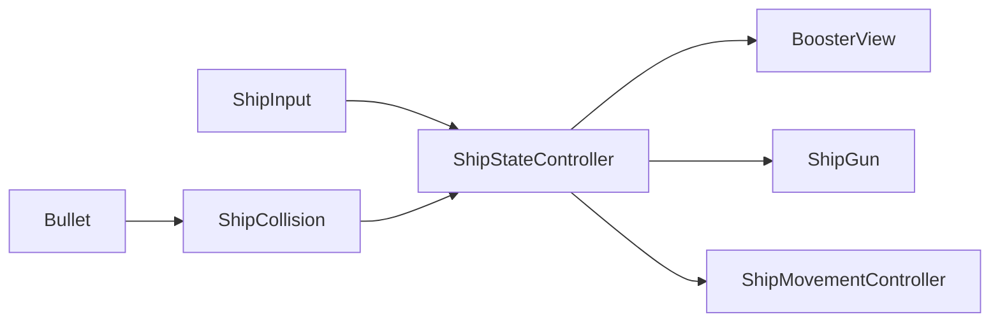

# Logs

### 2023/11/15 14:31

I'm starting the project now, before i setup source control and make some other decisions
I wanna see the shape that i want to get the code in, Initially my goal is to set a simple 
implementation that gets the Asteroids game concept working as soon as possible.
I'm planning to use the observer pattern extensively to drive the visual feedbacks,
initially I'm not planning to use any specific framework for this, but if the 
implementation ends up too cumbersome I may introduce UniRx package to the project

### 2023/11/15 15:03

I Liked this implementation because instead of having every system aware of and
directly accessing each other

we can do something like this where all the systems are aware of a shared system state

this will also give us more liberty to customize some behaviours after the base game is implemented

### 2023/11/16 16:51
Quick stop to create git repository and start tracking progress

### 2023/11/16 17:54
Created a component to control how objects in the game will wrap around the camera, i opted to 
create a controller where objects register themselves to have this behavior instead of putting it 
in each object to avoid the performance overhead of making fixed update calls for every object that
has this behaviour

### 2023/11/19 19:50
Implemented a bullet behaviour, bullet now has a simple state that is just a bool for now the the despawn/movement
mechanics are separated each in their own behaviour so it is easy to experiment in the future with different
bullet behaviors like powerups, also it is a bad practice to keep instantiating and destroying lots of objects, I'll
leave it like this for now, but if I have time a simple pooling system would easy the performance impact of this system